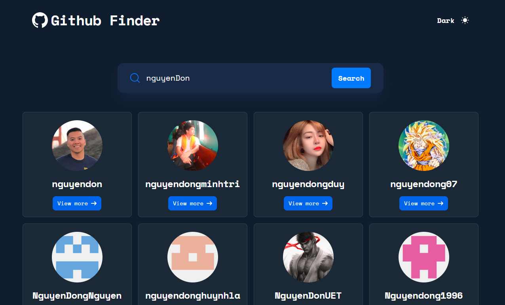

# Advanced Todo List

- Live Demo: https://advanced-todo-list-nguyendonuet.netlify.app/

#### Features

##### 1. Searching for GitHub users by their username

##### 2. Displaying relevant user information based on the search

##### 3. Providing the option to switch between light and dark themes

##### 4. Adapting the app's layout to the optimal view based on the user's device screen size

##### 5. Implementing pagination functionality

#### Technologies:

- Vuejs, TailwindCss
- Pinia, Vue-router, vueuse

#### Setup and run project

- `npm install`
- `npm run dev`
